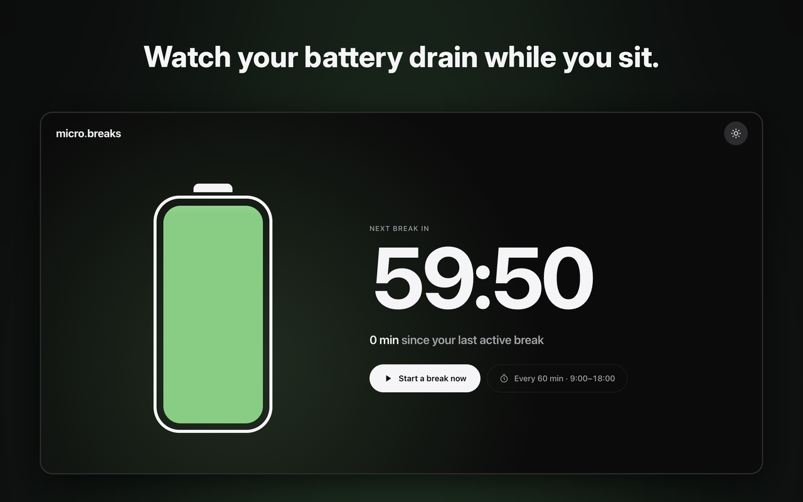
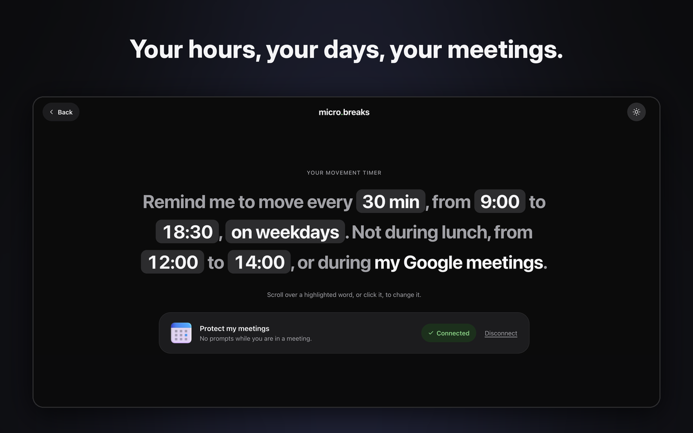

# 🔋 micro.breaks

**Sitting all day in front of your computer?**

micro.breaks helps you build regular movement breaks into your workday, at the office or at home, so you can stay energized, focused, and feel better in your body.

Your battery drains as you sit. When it's empty, it's time to move. Complete a five-minute mission to unlock Chrome and get back to work.

**No more snoozed reminders. Just five minutes to move, recharge, and get back to work.**

## 🚀 Install in 2 minutes

You need a **Mac** and **Google Chrome**. micro.breaks is still in testing, so it isn't on the Chrome Web Store yet.

1. ⬇️ **[Download micro.breaks.zip](https://github.com/tangigz/micro.breaks.app/releases/latest/download/micro.breaks.zip)**
2. 📂 Double-click the zip, then move the **micro.breaks** folder to your Documents. Keep it there: Chrome runs the extension from it.
3. 🧩 In Chrome, open `chrome://extensions` and turn on **Developer mode** (top right).
4. ➕ Click **Load unpacked** and pick the **micro.breaks** folder.
5. ✅ A welcome page opens. Enter your email, follow the three steps, and click **Start moving**.

If Chrome asks whether to keep the new tab page, say yes. That's where the battery lives.

## 🏃 Make your breaks happen

- 🔋 **See your sitting time add up.** Your new tab shows a battery that drains as you sit, counting down to your next movement break.
- 🔒 **Your break can't be ignored.** When it's time to move, Chrome keeps you on your break mission for five minutes, so you can't simply switch tabs and carry on working.
- 🚶 **Five-minute missions to get you moving.** We suggest what to do during your day: take a walk, grab some water, climb the stairs, or follow a quick stretch video.
- 🧮 **Think twice before skipping.** You have to solve a few math challenges if you want to unlock Chrome instead of completing your five-minute break.

## 🗓️ Fits your workday

- ⏰ **Your schedule, your rules.** Set your break frequency, working hours, days, and lunch break.
- 📅 **Meeting-safe.** Connect Google Calendar to avoid interruptions during meetings.
- 😴 **Off means off.** No breaks outside your working hours or on your days off.

## 💡 Good to know

- ⏰ **Change your hours:** click the timer chip on any new tab ("Every 60 min · 9:00–18:00").
- 🔔 **Notifications that vanish?** In **System Settings › Notifications › Google Chrome**, choose **Alerts**. Otherwise you'll miss the prompt when Chrome is behind another window.
- 📅 **Google Calendar (optional):** connect it and you're never prompted during a meeting. Send your Google address to Tangi first; only invited accounts can connect for now. Google will warn the app isn't verified: click **Advanced**, then continue.

## 🔄 Update

Download the new zip, replace what's in your **micro.breaks** folder, then click the reload arrow on the micro.breaks card in `chrome://extensions`. Your settings stay.

## 🗑️ Pause or remove

- ⏸️ **Pause:** in `chrome://extensions`, switch micro.breaks off. Switch it back on to resume. This also gets you out of a lock in an emergency.
- ❌ **Remove:** in `chrome://extensions`, click **Remove**. Your new tab is back to normal at once, and everything micro.breaks stored is deleted. You can then delete the folder.
- 📅 **Connected your calendar?** Remove the access at [myaccount.google.com/connections](https://myaccount.google.com/connections).

## 🔐 What is shared

To learn whether micro.breaks works, a few things are shared with its author, Tangi:

- ✅ **Shared:** your email, used only to recognise your installation and to contact you about your feedback, and what you do inside micro.breaks: installing it, finishing setup, missions started and completed, skips, and changes to your timer. This goes to [PostHog](https://posthog.com), hosted in the EU.
- 🚫 **Never shared:** the sites you visit, your tabs, or your calendar. Your busy times are read on your computer and stay there.

Removing the extension stops all of it.

## 💬 Feedback

Tell Tangi what annoyed you, what you skipped and why, and whether you'd keep it. That's what the test is for. 🙏
