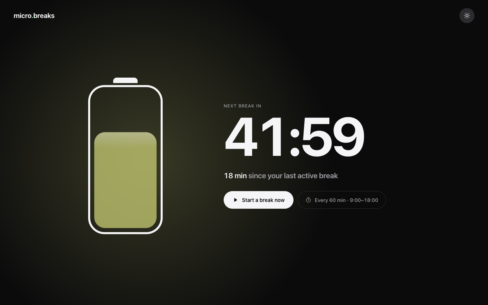
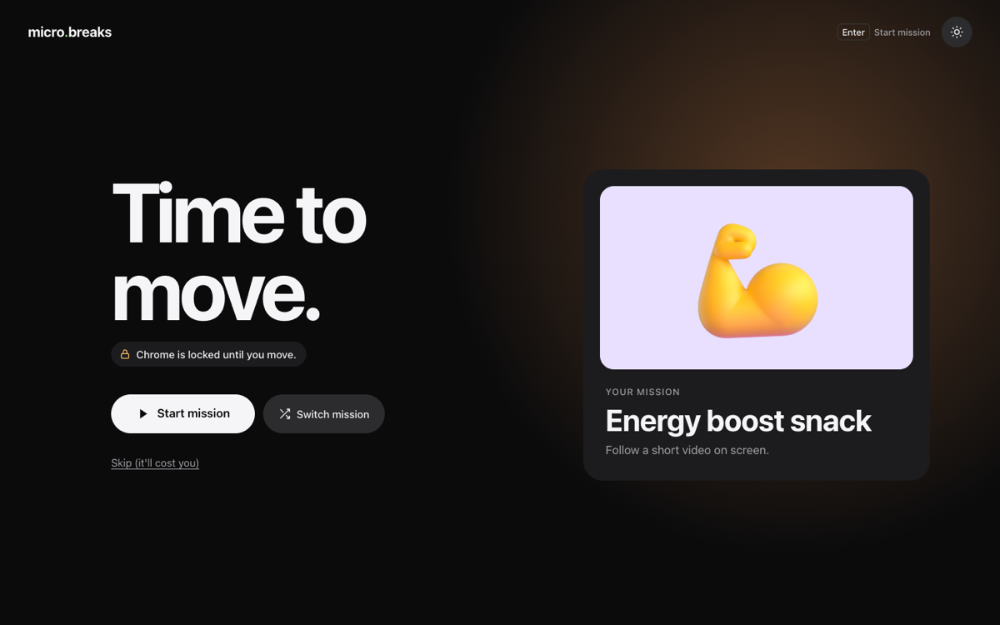

# 🔋 micro.breaks

**Move a little, every hour you sit.**

A battery on every new tab drains while you sit. When it's empty, Chrome locks onto one short mission that gets you out of your chair. Do it, and you're recharged.

## 🚀 Install in 2 minutes

You need a **Mac** and **Google Chrome**. micro.breaks is still in testing, so it isn't on the Chrome Web Store yet.

1. ⬇️ **[Download micro.breaks.zip](https://github.com/tangigz/micro.breaks.app/releases/latest/download/micro.breaks.zip)**
2. 📂 Double-click the zip, then move the **micro.breaks** folder to your Documents. Keep it there: Chrome runs the extension from it.
3. 🧩 In Chrome, open `chrome://extensions` and turn on **Developer mode** (top right).
4. ➕ Click **Load unpacked** and pick the **micro.breaks** folder.
5. ✅ A welcome page opens. Enter your email, follow the three steps, and click **Start moving**.

If Chrome asks whether to keep the new tab page, say yes. That's where the battery lives.

## 🏃 How it works

- 🔋 **The battery drains** while you sit, during the working hours you set.
- 🔒 **When it's empty, Chrome locks** onto one mission: a walk, a glass of water, a short stretch video. Your other apps are not blocked.
- ⚡ **Move, and it recharges.** Five minutes away from the keyboard does it.
- 🧮 **Really can't right now?** "Skip (it'll cost you)" lets you out, after a few sums or a sentence to type.
- 😴 **Quiet the rest of the time:** nothing outside your hours, at lunch, or on days off.

## 💡 Good to know

- ⏰ **Change your hours:** click the timer chip on any new tab ("Every 60 min · 9:00–18:00").
- 🔔 **Notifications that vanish?** In **System Settings › Notifications › Google Chrome**, choose **Alerts**. Otherwise you'll miss the prompt when Chrome is behind another window.
- 📅 **Google Calendar (optional):** connect it and you're never prompted during a meeting. Send your Google address to Tangi first; only invited accounts can connect for now. Google will warn the app isn't verified: click **Advanced**, then continue.

## 🔄 Update

Download the new zip, replace what's in your **micro.breaks** folder, then click the reload arrow on the micro.breaks card in `chrome://extensions`. Your settings stay.

## 🗑️ Pause or remove

- ⏸️ **Pause:** in `chrome://extensions`, switch micro.breaks off. Switch it back on to resume. This also gets you out of a lock in an emergency.
- ❌ **Remove:** in `chrome://extensions`, click **Remove**. Your new tab is back to normal at once, and everything micro.breaks stored is deleted. You can then delete the folder.
- 📅 **Connected your calendar?** Remove the access at [myaccount.google.com/connections](https://myaccount.google.com/connections).

## 🔐 What is shared

To learn whether micro.breaks works, a few things are shared with its author, Tangi:

- ✅ **Shared:** your email, and what you do inside micro.breaks: installing it, finishing setup, missions started and completed, skips, and changes to your timer. This goes to [PostHog](https://posthog.com), hosted in the EU.
- 🚫 **Never shared:** the sites you visit, your tabs, or your calendar. Your busy times are read on your computer and stay there.

Removing the extension stops all of it.

## 💬 Feedback

Tell Tangi what annoyed you, what you skipped and why, and whether you'd keep it. That's what the test is for. 🙏
